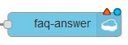
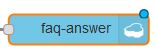
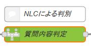
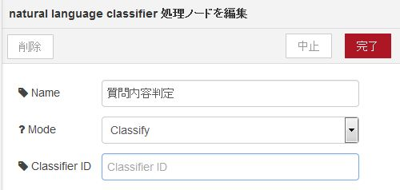

# 汎用FAQ自動応答デモアプリ

このプロジェクトは、IBM Watson Natural Language Classifier (NLC) を使用したFAQ自動応答アプリです。

## 【実行環境】

- Runtime : Node-RED (Node.js)
- Services :
    - Cloudant NoSQL DB
    - Watson Natural Language Classifier

## 【環境構築手順】

1. ボイラープレート『Node-RED Starter』にて、ランタイムを作成する。
1. NLCサービスを作成し、ランタイムにバインドする。
1. 本プロジェクトをZIPでダウンロードし、ローカルPCに展開する。
1. 展開したディレクトリからcf push [app-name] でBluemixにデプロイする。
1. ランタイム起動後、『アプリの表示』ボタンにて、Node-REDアプリを起動する。
1. トップページ右側の赤いボタンの下にある１～５の手順を実施する。
1. 環境が整ったのち、手順６でデモアプリを起動する。

## 【FAQデータ形式】

### 1. 質問データ

- CSV形式で定義します。データ項目は、質問文, class_name の２つです。
    - 質問文 : 回答を導き出すための質問を文章で登録します。
    - class_name : 回答データのclass_nameに対応します。
- 1つのclass_nameに複数の質問文を登録することで、Classifierの精度を高めることが出来ます。
- utf-8で保存してください。

#### 設定例

~~~~
回答データ001に対する質問文その１です, FAQ001
回答データ001に対する別の表現の質問文です, FAQ001
回答データ002用の質問文001, FAQ002
~~~~

### 2. 回答データ

- JSON形式で定義します。データ項目はclass_name, answer, ref_url の3つです。
    - class_name : 一意なFAQのID
    - answer : 回答内容
    - ref_url : 詳細な内容に誘導するURL。URLが無い場合は""を指定する。
- 1つの回答データで、１対の{...}になります。データが複数ある場合は、コンマで区切ります。
    - {...}, {...}, ......
- utf-8で保存してください。

#### 設定例

~~~~
{ "class_name" : "FAQ001", "answer" : "よくある質問その１の回答です。詳細はURLをご参照ください。", "ref_url" : "http://www.foo.bar.com/faq/001"},
{ "class_name" : "FAQ002", "answer" : "よくある質問その２の回答です。詳細はURLをご参照ください。", "ref_url" : "http://www.foo.bar.com/faq/002"},
{ "class_name" : "FAQ003", "answer" : "最後の行の末尾にはコンマをつけないでください。", "ref_url" : ""}
~~~~

### 【データの登録方法】

#### 1. 質問データの学習

1. Node-REDアプリを使用する場合
    1. Node-REDトップページの手順３でリンクされるページで、質問データファイルを指定しSubmitする。
    1. 結果ページにClassifier IDが表示されるので、テキストエディタなどにコピー＆ペーストして保存しておく。
    1. 登録エラーになった場合、Node-REDのフローエディタでdebugにエラーが出力されているか確認する。
    1. 質問データの学習が完了したかどうかは、後述のコマンドラインにて確認する。

1. NLC ツールキット(ベータ版)を使用する場合 (米国南部のみ)
    1. BluemixコンソールからNLCサービスの管理画面に遷移し、『Access the beta toolkit』のボタンをクリック
    1. Login画面が表示された場合は、『Sign in with Bluemix』リンクをクリック
    1. ツールキット画面右上部にある『Training data』をクリック
    1. ファイルアップロードボタンを押し、質問データファイルを送信する
    1. ファイルの内容が画面に表示されたら、『Create classifier』ボタンをクリックして、Classifier名を指定する。
    1. 数分後にClassifiersが学習済みとなるので、表示されている『Classifier ID』のID番号をコピーする

#### 2. 回答データの登録

1. JSON形式で回答データファイルを作成する。(utf-8)
1. Node-REDトップページにある手順3のリンクで登録画面を開き、回答データファイルを送信する。
1. 正常終了のメッセージ画面が表示すれば登録完了。
1. 登録エラーになった場合、Node-REDのフローエディタでdebugにエラーが出力されているか確認する。
1. CloudantNoSQLDBを開き、インデックスを定義する。
    1. データベース "faq-answer"を開き、"Design Documents"の'+'をクリックし、"New Search Index"を選択する。
    1. 以下の入力フィールドに値を設定する。

| 入力項目 | 値 |
|---------|----|
| _design/ | index |
| Index name | byClassName |
| Search index function | function (doc) {  index("class_name", doc.class_name, {"store":true});} |

### 【フロー定義】

- flow_0.jsonからflow_3.jsonまでテキストエディタで開き、それぞれをクリップボードにコピーし、Node-REDフローエディタからインポートする。
- 各Cloudant NoSQL DBがエラー(  )となっているため、ノードをダブルクリックして開き、ServiceフィールドにCloudantNoSQLDBのサービスr名が入っていることを確認し、完了ボタンをクリックする。
- Cloudant NoSQL DBノードのエラーがなくなったことを確認する(  )
- flow_2のNLCノード(  )のClassifier IDに学習済みのClassifier IDをセット(  )して完了ボタンをクリックする。
- 最後にデプロイをクリ行くする。

### 【コマンドラインの使用方法】
#### (bashを実行できる環境が前提となっています)

1. Node-REDトップページの手順５のページで、1～5までのファイルをDLする。
1. DLした『nlc.env』ファイルを開き、NLCの資格情報からusernameとpasswordを設定する。
1. 拡張子".bash"のファイルに実行権限を付与する。
1. 各コマンドの役割は以下の通り

| コマンド | 内容 |
|----------|------|
| training.bash | 質問データを学習させる。データファイルを引数に実行する。 |
| classifier.bash | 引数で指定されたClassifier IDの学習状態を確認する。statusが『Available』になれば、学習完了 |
| list_classifiers.bash | 対象のNLCサービスが学習している全Classifierのリストを表示する |
| rm_classifier.bash | 引数で指定されたClassifier IDに対応する学習データを削除する |
